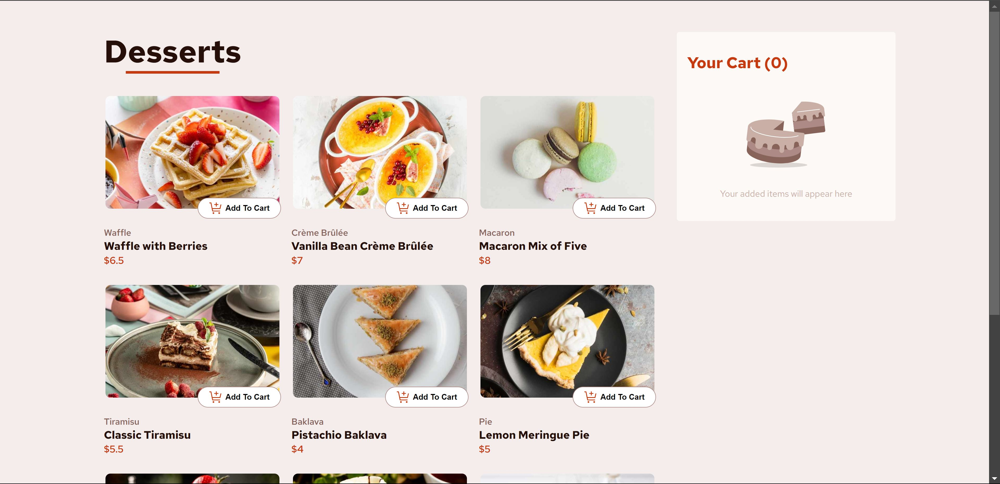
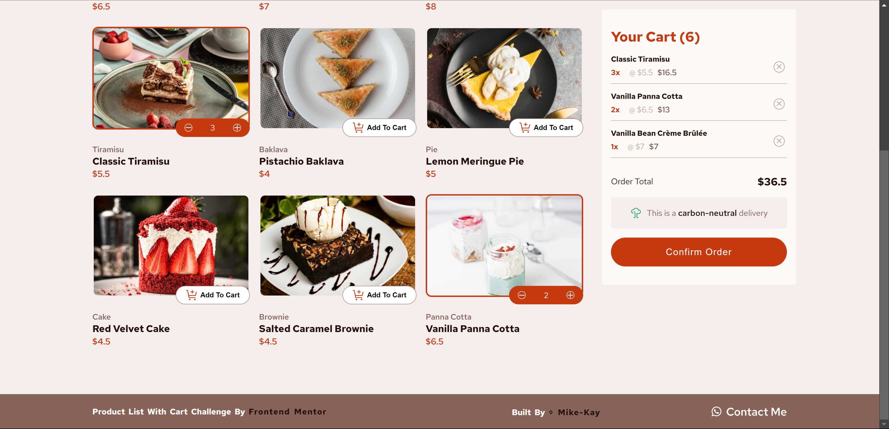
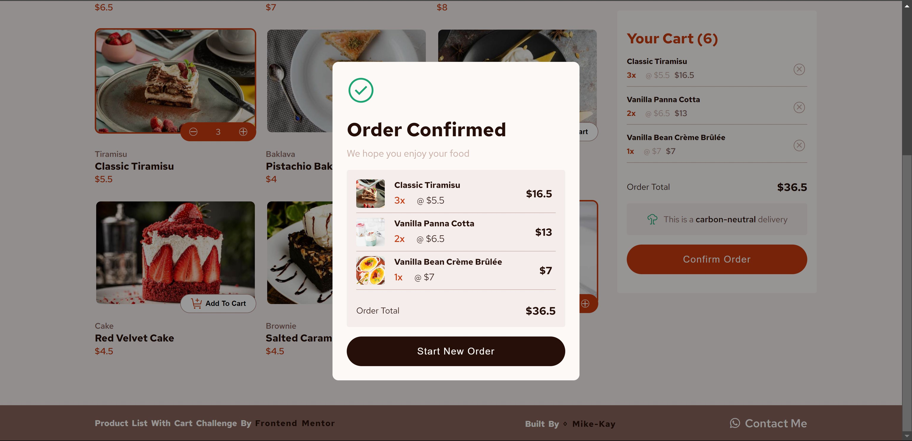

# Frontend Mentor - Product list with cart solution

This is a solution to the [Product list with cart challenge on Frontend Mentor](https://www.frontendmentor.io/challenges/product-list-with-cart-5MmqLVAp_d). Frontend Mentor challenges help you improve your coding skills by building realistic projects.

## Table of contents

- [Overview](#overview)
  - [The challenge](#the-challenge)
  - [Screenshot](#screenshot)
  - [Links](#links)
- [My process](#my-process)
  - [Built with](#built-with)
  - [What I learned](#what-i-learned)
  - [Continued development](#continued-development)
- [Author](#author)
- [Acknowledgments](#acknowledgments)

## Overview

### The challenge

Users should be able to:

- Add items to the cart and remove them
- Increase/decrease the number of items in the cart
- See an order confirmation modal when they click "Confirm Order"
- Reset their selections when they click "Start New Order"
- View the optimal layout for the interface depending on their device's screen size
- See hover and focus states for all interactive elements on the page

### Screenshot

### Links

- Solution URL: [Solution URL here](https://www.frontendmentor.io/solutions/responsive-product-list-with-cart-ukgXTeSNMl)
- Live Site URL: [Live site URL here](https://01-product-list-with-cart.netlify.app/)

## My process

### Built with

- Semantic HTML5 markup
- CSS custom properties
- Flexbox
- CSS Grid
- Mobile-first workflow
- JavaScript Module

### What I learned

This project prompted me to learn what variable fonts are, their basic understanting, and their numerous applications. This is something i didn't know of, and i'm glad i found out about it.

### Continued development

Working with SVGs to create and style icons is something i never realised until i almost completed the project, in fact, until I completed my third project. I am used to working with font awesome icons for example, and then styling my icons as i see fit, so it was a bit difficult for me to style the svg icons that were provided. Nonetheless, i intend to learn more about SVGs and their application.

## Author

- Frontend Mentor - [@Mike-Kay](https://www.frontendmentor.io/profile/Mike-Kay)
- Twitter - [@Mike_Kay1](https://www.twitter.com/@Mike_Kay1)

## Acknowledgments

Hats off to my instructor John Smilga - (https://johnsmilga.com/), his JS course on Udemy - (https://www.udemy.com/user/janis-smilga-3/?kw=john+smilga&src=sac) really made it easier for me to build this project.
